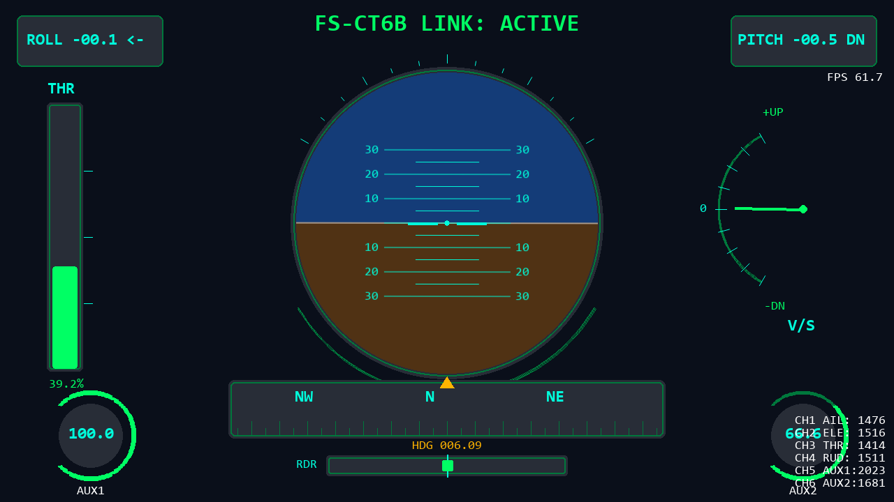

# FlyHigh: FS-CT6B Pygame Cockpit HUD

A real-time aircraft-style RC dashboard built with Python + Pygame.

It reads live channel data from a FlySky FS-CT6B transmitter over serial (`COM6`, `115200`) and renders a dark military-style HUD/cockpit at 1280x720.



## Features

- Live serial ingestion on a background thread (main thread is render-only)
- Artificial horizon with roll + pitch ladder
- Vertical throttle bar
- Scrolling heading strip compass with accumulated heading
- Rudder position bar
- Variometer / climb-rate arc gauge
- AUX1 / AUX2 knob arc gauges
- Top-corner roll and pitch numeric indicators
- Link status overlay:
  - `FS-CT6B LINK: ACTIVE` (green)
  - `NO SIGNAL` if no data for > 1 second
  - `SERIAL ERROR - CHECK COM6` if port open/read fails
- Raw microsecond channel dump (CH1-CH6)
- FPS display
- Graceful quit on window close or `Esc`

## Requirements

- Python 3.9+ (works on Windows)
- `pygame`
- `pyserial`

## Install

From the project folder:

```powershell
pip install pygame pyserial
```

## Run

```powershell
python main.py
```

## Controls

- `Esc`: exit
- Window close button: exit

## Serial Protocol (implemented)

- Port: `COM6`
- Baud: `115200`
- Frame header: `0x55 0xFC`
- Payload: 14 bytes
- Channel unpack format: `>6H`

Channels:

- CH1: aileron
- CH2: elevator
- CH3: throttle
- CH4: rudder
- CH5: aux2
- CH6: aux1

## Calibration / Normalization

Measured ranges are hard-coded in `main.py` under `CH_RANGES`.

- `aileron`, `elevator`, `rudder` -> normalized to `-1.0 ... +1.0`
- `throttle`, `aux1`, `aux2` -> converted to `0 ... 100%`

If your transmitter calibration differs, update `CH_RANGES` in `main.py`.

## Notes

- If `COM6` is wrong on your machine, change `PORT` at the top of `main.py`.
- The app keeps rendering even if serial fails; values remain safe/zeroed until signal returns.
- Heading is integrated over time from rudder input:
  - `heading += rudder * 2.0 * dt` (wrapped to `0..360`)
